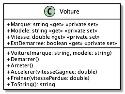

# Module 03 - Traitement des exceptions et exceptions utilisateur

N'oubliez pas de faire vos tests unitaires excepté pour l'exercice 1.


## Exercice 1 - Lecture dans un fichier

Faîtes un programme C# qui demande à l'utilisateur le chemin absolu d'un fichier texte et qui l'affiche à l'écran.

Ne cherchez pas à valider si le fichier existe. Si une erreur est détectée durant l'ouverture du fichier, affichez un message spécifique en français de l'erreur, le message original ainsi que la pile d'appels.

Pour ouvrir le fichier texte en lecture, inspirez-vous du code suivant :
```csharp
using (StreamReader sr = new StreamReader(nomFichier))
{
    // Tant que nous ne sommes pas arrivés à la fin du fichier
    while (!sr.EndOfStream)
    {
        // Lire une ligne
        string ligneActuelleDuFichier = sr.ReadLine();
        // Utilisez ligneActuelleDuFichier en complétant...
    }
}
```

## Exercice 2 - Matrices

Le but de l'exercice est de se doter d'une bibliothèque permettant de faire des calculs sur des matrices 2D.

En cas de paramètres incorrectes, vous devez créer vos propres exceptions. Créez la classe d'exception "DimensionsNonConcordantesException". Elle devrait vous servir pour les préconditions. (De quelle classe vos classes d'exception vont hériter ?)

Créez la classe "Matrice2D" qui permet de représenter des matrices 2D. Le type de valeurs de votre matrice est float.

Les données peuvent être représentées par une tableau à deux dimensions. Pour cela, vous pouvez vous inspirer de l'exemple suivant sur les tableaux 2D :

```csharp
double[,] tableau2D = new double[3, 4];
Console.Out.WriteLine($"Nombre de dimension : {tableau2D.Rank}");
Console.Out.WriteLine($"Capacité dimension 1 : {tableau2D.GetLength(0)}");
Console.Out.WriteLine($"Capacité dimension 2 : {tableau2D.GetLength(1)}");
for (int indiceLigne = 0; indiceLigne < tableau2D.GetLength(0); indiceLigne++)
{
    Console.Out.Write(tableau2D[indiceLigne, 0]);
    for (int indiceColonne = 1; indiceColonne < tableau2D.GetLength(1); indiceColonne++)
    {
        Console.Out.Write($", {tableau2D[indiceLigne, indiceColonne]}");
    }
    Console.Out.WriteLine();
}
```

Écrivez les propriétés suivantes :

- [ [int p_ligne, int p_colonne] ](https://docs.microsoft.com/en-us/dotnet/csharp/programming-guide/indexers/using-indexers) : permet d'accèder à une valeur par sa ligne et sa colonne
- NombreDeLignes (get seulement) : permet de connaitre le nombre de lignes de la matrice
- NombreDeColonnes (get seulement) : permet de connaitre le nombre de colonnes de la matrice

Écrivez les constructeurs d'initialisations suivants :

- Deux paramètres : prend en paramètres le nombre de lignes et de colonnes et construit une matrice avec ces dimensions données
- Un paramètre : prend en paramètres un tableau deux dimensions de float et construit une matrice avec les mêmes dimensions que le tableau passé en paramètres et avec les mêmes données

Écrivez les méthodes suivantes :

- "Equals" : prend en paramètres une autre matrice et renvoie vrai si elle est égale à votre objet courant, faux sinon.
- "Identite" : prend en paramètres une dimension de matrice et renvoie la matrice carré identité correspondante à la dimension.
- "Transpose" : prend une matrice en paramètre et renvoie sa transposée.

Écrivez les opérateurs suivants ([Documentation](https://docs.microsoft.com/en-us/dotnet/csharp/language-reference/operators/operator-overloading)) :

- \* : prend deux matrices en paramètres et renvoie le résultat de la multiplication de ces deux matrices
- \* : prend une matrice et une valeur v en paramètres et renvoie le résultat de la multiplication de chaque valeur de la matrice par la valeur v
- +/-: prend deux matrices en paramètres et renvoie une nouvelle matrice dont chaque case correspond à la somme des cases aux mêmes coordonnées prisent dans les deux opérandes

Écrivez les tests unitaires pour la classe "Matrice2D".

## Exercice 3 - Voiture (Optionnel)



Créez la classe "Voiture" en suivant le modèle de classes fourni.

La voiture a une vitesse à 0 quand elle est à l'arrêt. La voiture ne peut s'arrêter qu'une fois la vitesse inférieure à 5 km/h et sa vitesse devient nulle.

La voiture ne peut pas accélerer au delà de 230 km / h et ne peut pas avoir une vitesse inférieure à 0 km / h.

La méthode "AfficherEtat" affiche la marque de la voiture, son modèle, son statut d'alimentation et sa vitesse.

Le constructeur initialise les valeurs de marque et de modèle en utilisant les valeurs passées en paramètres. Vous devez aussi mettre la valeur de vitesse à 0 et le statut de démarrage à faux.

Vos méthodes doivent lever des exceptions personnalisées comme : VoitureDemarreeException, VoitureArreteeException, VitesseMaximaleAtteinteException, etc.

Écrivez un sous-programme qui permet de :

1. Créer une nouvelle voiture
2. Démarrer la voiture
3. Arreter la voiture
4. Accelerer
5. Freiner
6. Afficher l'état
7. Quitter

Le programme ne doit pas planter aux yeux de l'utilisateur.

Écrivez les tests unitaires des méthodes testables, c'est à dire celles qui n'affiche pas d'information et n'en demande pas à l'utilisateur.
