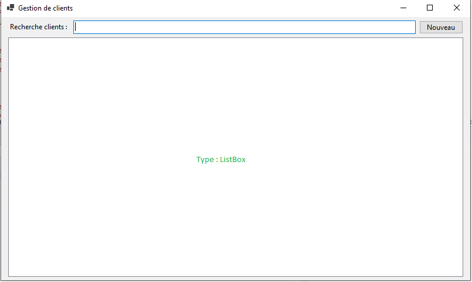
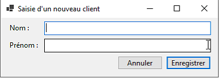

# Module 09 - Application graphique 2 / 2

Dans cette deuxième partie de module, nous allons reprendre le code de la correction partielle du module 07.

## Exercice 1 - Création du projet et des formulaires

- Créez la solution "POOII_Module10_GestionClients" avec un projet de type "Windows Forms App (.Net Core)" (il faut minimalement avoir .Net Core 3.1)
- Renommer le nom de la fenêtre principale et de ses classes pour "fPrincipale"
- Dans le nouveau projet créé, installez les packages Nuget suivants :
  - Microsoft.Extensions.Configuration
  - Microsoft.Extensions.Configuration.FileExtensions
  - Microsoft.Extensions.Configuration.Json
- Ajoutez les dépendances de projets nécessaires à l'exploitation du dépot de clients
- Ouvrez le répertoire de la solution et copiez les projets "GC.*" de la correction partielle
- Placez-vous dans la classe "fPrincipale" du projet "POOII_Module10_GestionClients". Modifiez le constructeur afin qu'il prenne un dépot de client en paramètres. Copiez sa référence dans une donnée membre
- Placez-vous dans la classe "Program" du même projet. Modifiez la méthode main en vous inspirant d'une des applications console de la correction partielle.
- Créée le fichier "appsettings.json" et placez le à la racine du projet. Indiquez au compilateur de le copier dans le répertoire de sortie.
- Modifiez "fPrincpale" pour qu'elle ressemble à la copie d'écran suivante (Les contrôles doivent s'adapter à la dimension de la fenêtre) :

- Créer une nouvelle fenêtre avec le nom "fSaisieClient" et modifiez la pour qu'elle ressemble à la copie d'écran suivante :

- Assurez vous que la fenêtre et que les contrôles suivants soient configurés comme suit :
  - "bAnnuler"
    - "DialogResult" : "Cancel"
  - "bEnregistrer"
    - "DialogResult" : "OK"
  - "fSaisieClient" :
    - "AcceptButton" : "bEnregistrer"
    - "CancelButton" : "bAnnuler"
    - "FormBorderStyle" : "FixedSingle"

## Exercice 2 - Fenêtre "fSaisieClient"

- Dans la classe partielle "fSaisieClient", ajoutez les propriétés suivantes :
  - "Client" de type "Client" : la valeur est nulle si la fenêtre va servir pour saisir un nouveau client, non nulle si c'est pour modifier un client existant
  - "Nouveau" de type "bool" : propriété sans set qui renvoie vrai si la fenêtre est utilisée pour créer un nouveau client, faux sinon (Indice : dépend de la valeur de la propriété "Client")
  - "Result" de type "Client" : servira à contenir la nouvelle valeur d'un client si l'utilisateur clique sur "Enregistrer"
- Toujours dans cette classe, modifiez le contructeur par défaut pour modifier le titre de la fenêtre pour "Saisie d'un nouveau client" quand la propriété "Nouveau" est à vrai, "Modification d'un client" sinon.
- Toujours dans cette classe, enregistrez une fonction sur l'événement "Load" de la fenêtre. Ajoutez un fragment de code afin de modifier les valeurs des "Textbox" représentant les informations du client passé dans la propriété "Client" si la propriété "Nouveau" est à faux.
- Toujours dans cette classe, enregistrez une fonction sur l'événement "Click" du bouton "Enregistrer". Ajoutez un fragment de code afin de créer un nouvel objet "Client" qui contient soit le nouveau client ou le client modifié. Affectez la propriété "Result" avec l'objet créé.

## Exercice 4 - Dépot de clients

- Modifiez l'interface de dépot de clients pour y ajouter la méthode "List<Client> RechercherClients(string p_informationPartielle);" : elle permet de chercher un client qui a un nom ou un prénom qui contient le texte contenu dans le paramètre "p_informationPartielle"
- Modifiez les dépots afin d'ajouter la nouvelle méthode. Afin de facilité la lecture de votre code, vous devez utiliser des requêtes Linq
- Implantez la méthode "ToString" de l'entité "Client" afin qu'elle renvoie une chaine composée du prénom et du nom du client

## Exercice 3 - Fenêtre "fPrincipale"

- Ouvrez le designer de formulaires sur le formulaire principal
- Ajoutez une méthode sur l'événement "TextChanged" du "Textbox" et modifiez son code afin qu'elle ajoute les clients contenants le texte du contrôle dans leurs noms et prénoms dans le contrôle "ListBox". Utilisez les méthodes "Clear" et "AddRange(object[])" du "ListBox"
- Ajoutez une méthode sur l'événement "Click" du bouton "Nouveau" et modifiez son code afin qu'elle ouvre une fenêtre de type "fSaisieClient". Pour cela, vous allez utiliser la méthode "ShowDialog" de la fenêtre en lui passant la référence de la fenêtre principale en paramètres. Si le résultat de l'appel est "OK", ajoutez le client au dépot
- Ajoutez une méthode sur l'événement "DoubleClick" du contrôle "ListBox" et modifiez son code afin qu'elle ouvre une fenêtre de type "fSaisieClient" avec, en contexte, le client sélectionné. Pour cela, vous allez affecter la propriété "Client" de la fenêtre et vous allez utiliser la méthode "ShowDialog" de la fenêtre en lui passant la référence de la fenêtre principale en paramètres. Pour récupérer l'objet sélectionné, vous pouvez utiliser la propriété "SelectedItem" du contrôle. Si le résultat de l'appel est "OK", modifiez le client