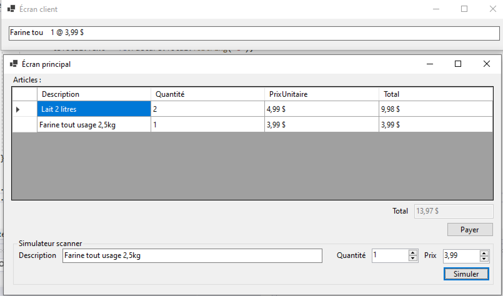

# Module 10 - Patron de conception 02

## Exercice 1 - Caisse enregistreuse

Dans cet exercice, nous allons simuler une partie d'une caisse enregistreuse.

L'application simule deux périphériques de sortie : l'écran principal et l'écran client. L'écran principal affiche la facture ainsi qu'une zone de saisie qui permet de simuler un scanner de codes barre. L'écran monoligne du client affiche "Bienvenue" pour accueillir un nouveau client. Ensuite, à chaque nouvelle ligne saisie (simulation du scanner), l'écran affiche la description de l'article, la quantité et le prix total.

### Exercice 1.1 - Écran principal

- Reproduisez l'écran principal
  - Pour l'affichage de la facture, utilisez un "DataGridView". Empêchez l'édition dans ce contrôle.
  - Pour la simulation, mettez tous les contrôles dans un "GroupBox".
  - Les saisies d'entiers ou de décimaux doivent être effectuées avec des contrôles de type "NumericUpDown

- La fenêtre doit pouvoir être redimensionnée tout en gardant son aspect :

### Exercice 1.2 - Écran client

Reproduisez l'écran client :

### Exercice 1.3 - Facture

- Créez la classe "Facture" qui permet de stocker des lignes de facture
- Une ligne de facture à une description, une quantité, un prix unitaire et un total
- La facture doit être implanter l'interface "IObservable". Le type d'éléments envoyé pour les notifications est "FactureEvent".
- "FactureEvent" contient trois propriétés :
  - Type : type de l'événement, soit "AJOUT_LIGNE" envoyé pour l'ajout d'une ligne dans la facture, soit "NOUVELLE" pour la création d'une nouvelle facture.
  - LigneFacture : référence de la ligne de facture quand le type d'événement est "AJOUT_LIGNE", null sinon
  - Facture : référence de la facture qui a déclenchée l'événement
- La facture doit implanter une méthode pour l'ajout d'une ligne de facture. Cet ajout doit aussi s'occuper de notifier les observateurs de l'événement.
- La facture doit implanter une méthode pour la suppression de toutes les lignes de la facture. Cet ajout doit aussi s'occuper de notifier les observateurs de l'événement.

### Exercice 1.4 - Observateurs

- Créez la classe "ObservateurFacture" qui implante l'interface "IObserver<FactureEvent>"
- Cette classe doit avoir un constructeur par initialisation qui prend une lambda en paramètres et qui réagit au "FactureEvent" passé en paramètres
- En utilisant la classe "ObservateurFacture" et des lambdas appropriées :
  - Au moment de la réception d'une nouvelle ligne :
    - Ajoutez la ligne dans le "DataGridView"
    - Affichez la ligne ajoutée sur l'écran du client

  - Au moment de la réception d'une demande de nouvelle facture :
    - Videz le "DataGridView"
    - Affichez "Bienvenue" sur l'écran client

  - Vérifiez manuellement que tout fonctionne
  
## Exercice 1.5 - Ajout d'une simulation d'imprimante (Optionnel)

Ajoutez une autre fenêtre qui va simuler une imprimant de tickets de caisse. À l'ajout du premier article, l'imprimante inscrit les informations de l'entreprise. À l'événement d'une nouvelle facture, l'imprimante inscrit le total et remercie le client de sa visite.

## Exercice 2 - Copie de fichiers (Optionnel)

Dans cet exercice, vous devez proposer une interface qui propose de copier un répertoire vers un autre en affichant l'avancement avec une barre de progression.

Le premier est le répertoire à copier. Le second est le répertoire de destination. Le répertoire de destination doit exister et être vide.

Si toutes les conditions sont rencontrées, l'utilisateur peut cliquer sur un bouton qui démarre la copie.

Durant la copie, l'utilisateur doit pouvoir annuler la copie en cliquant sur un bouton.

La copie doit être effectuée en arrière plan. Pour implanter la copie en arrière plan, vous devez utiliser la classe [BackgroundWorker](https://docs.microsoft.com/en-us/dotnet/api/system.componentmodel.backgroundworker?view=netcore-3.1).

Pour l'algorithme de copie, vous devez ouvrir chaque fichier en binaire : le premier en lecture, le second en écriture. Chaque lecture doit être d'au minimum 512 octets.
